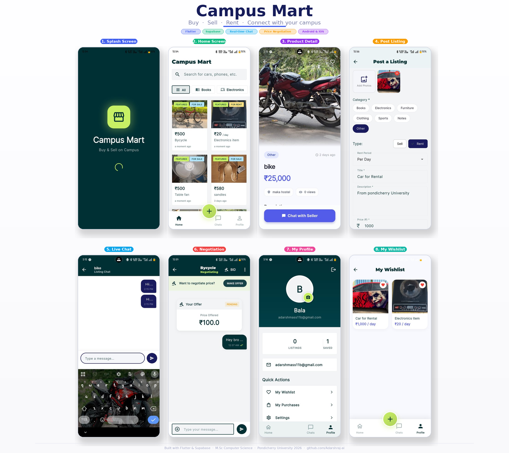

# 📱 University Campus Mart

> A full-stack cross-platform mobile marketplace built for university students — buy, sell, rent, and exchange campus resources with real-time chat and price negotiation.

<div align="center">


</div>

---

## 🖼️ App Preview

<div align="center">

</div>

---

## 🎬 App Demo

<div align="center">

</div>

---

## 📌 Overview

University students spend a lot on textbooks, electronics, and other resources every semester — and have no trusted platform to sell them afterward. **Campus Mart** solves this by creating a peer-to-peer marketplace exclusively for the university community.

Students can list items for **sale or rent**, browse by category, chat directly with sellers, and even **negotiate prices** through a built-in bidding system — all within one app.

---

## ✨ Features

| Feature | Status |
|---------|--------|
| 🔐 Email Signup & Login | ✅ |
| 🏠 Home Feed with Real-time Listings | ✅ |
| 🏷️ For Sale & For Rent with Rent Period | ✅ |
| 📸 Multi-Photo Upload | ✅ |
| 🔍 Search & Category Filter | ✅ |
| 💬 Real-time Chat | ✅ |
| 🤝 Price Negotiation / Bidding | ✅ |
| ❤️ Wishlist / Favourites | ✅ |
| 👤 Seller Profiles | ✅ |
| 📍 Location Tags | ✅ |
| 🛒 My Purchases | ✅ |

---

## 🛠️ Tech Stack

| Layer | Technology |
|-------|-----------|
| Frontend | Flutter (Dart) |
| State Management | Provider |
| Backend-as-a-Service | Supabase (Auth, Realtime DB, Storage) |
| Database | MySQL (via REST API) |
| UI Design | Material Design 3 |
| Platform | Android & iOS |

---

## 🚀 Getting Started

```bash
# 1. Clone the repository
git clone https://github.com/Adarshraj-ai/University-Campusmart.git

# 2. Navigate into project
cd University-Campusmart/campus-mart

# 3. Install dependencies
flutter pub get

# 4. Update Supabase credentials in lib/main.dart

# 5. Run on Android device
flutter run
```

---

## 📊 Project Stats

- 🗓️ **Built in:** 4 months (2024–2025)
- 📱 **Screens:** 10+ fully designed screens
- ⚙️ **Features:** 11 core features
- 🏗️ **Architecture:** Feature-first with Provider pattern
- 🎓 **Context:** Main semester project — M.Sc CS, Pondicherry University 2026

---

## 👨‍💻 Author

**Adarsh Singh**
📧 adarshmass111b@gmail.com
🔗 [github.com/Adarshraj-ai](https://github.com/Adarshraj-ai)

---

> ⭐ If you found this useful or impressive, leave a star!
